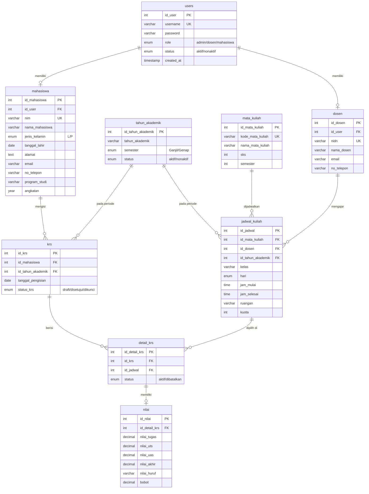

# Entity Relationship Diagram (ERD) - SIAKAD

## Diagram ERD

---

## Penjelasan Setiap Tabel

### 1. Tabel `users`
Menyimpan data akun login untuk semua pengguna (Admin, Dosen, Mahasiswa). Setiap pengguna memiliki satu akun dengan role tertentu. Password disimpan dalam bentuk hash menggunakan `password_hash()`.

### 2. Tabel `mahasiswa`
Menyimpan data profil lengkap mahasiswa. Setiap record terhubung ke tabel `users` melalui `id_user` untuk keperluan autentikasi. NIM bersifat unik.

### 3. Tabel `dosen`
Menyimpan data profil dosen. Setiap record terhubung ke tabel `users` melalui `id_user`. NIDN bersifat unik.

### 4. Tabel `mata_kuliah`
Menyimpan data master mata kuliah meliputi kode, nama, jumlah SKS, dan semester. Kode mata kuliah bersifat unik.

### 5. Tabel `tahun_akademik`
Menyimpan data periode akademik (contoh: 2024/2025 Ganjil). Hanya satu periode yang boleh berstatus aktif pada satu waktu. Kombinasi tahun dan semester bersifat unik.

### 6. Tabel `jadwal_kuliah`
Menyimpan jadwal perkuliahan yang menghubungkan mata kuliah, dosen pengampu, dan tahun akademik. Termasuk informasi kelas, hari, waktu, ruangan, dan kuota.

### 7. Tabel `krs`
Menyimpan header KRS (Kartu Rencana Studi) per mahasiswa per tahun akademik. Setiap mahasiswa hanya boleh memiliki satu KRS per periode (diterapkan oleh UNIQUE constraint). Status KRS bisa `draft`, `disetujui`, atau `dikunci`.

### 8. Tabel `detail_krs`
Menyimpan detail mata kuliah yang dipilih dalam KRS. Setiap record menunjuk ke jadwal kuliah tertentu. Kombinasi KRS dan jadwal bersifat unik untuk mencegah duplikasi.

### 9. Tabel `nilai`
Menyimpan nilai mahasiswa per mata kuliah. Terhubung ke `detail_krs` secara one-to-one (UNIQUE). Berisi nilai komponen (tugas, UTS, UAS), nilai akhir yang dihitung otomatis, nilai huruf, dan bobot.

---

## Relasi Antar Tabel

| No | Relasi | Tipe | Keterangan |
|----|--------|------|------------|
| 1 | users → mahasiswa | One-to-One | Satu akun user untuk satu mahasiswa |
| 2 | users → dosen | One-to-One | Satu akun user untuk satu dosen |
| 3 | mahasiswa → krs | One-to-Many | Satu mahasiswa bisa punya banyak KRS (per semester) |
| 4 | tahun_akademik → krs | One-to-Many | Satu periode memiliki banyak KRS |
| 5 | tahun_akademik → jadwal_kuliah | One-to-Many | Satu periode memiliki banyak jadwal |
| 6 | krs → detail_krs | One-to-Many | Satu KRS berisi banyak mata kuliah |
| 7 | jadwal_kuliah → detail_krs | One-to-Many | Satu jadwal bisa dipilih banyak mahasiswa |
| 8 | mata_kuliah → jadwal_kuliah | One-to-Many | Satu mata kuliah bisa dijadwalkan berkali-kali |
| 9 | dosen → jadwal_kuliah | One-to-Many | Satu dosen bisa mengajar banyak jadwal |
| 10 | detail_krs → nilai | One-to-One | Satu detail KRS memiliki satu record nilai |

---

## Constraint dan Validasi Database

- **UNIQUE** pada `users.username`, `mahasiswa.nim`, `dosen.nidn`, `mata_kuliah.kode_mata_kuliah`
- **UNIQUE** pada kombinasi `krs(id_mahasiswa, id_tahun_akademik)` — mencegah KRS ganda
- **UNIQUE** pada kombinasi `detail_krs(id_krs, id_jadwal)` — mencegah mata kuliah ganda dalam KRS
- **UNIQUE** pada `nilai.id_detail_krs` — satu nilai per detail KRS
- **UNIQUE** pada kombinasi `tahun_akademik(tahun_akademik, semester)` — mencegah duplikasi periode
- **ON DELETE CASCADE** pada semua foreign key — menghapus data terkait secara otomatis
- **ENUM** digunakan untuk membatasi nilai kolom (role, status, jenis_kelamin, hari, semester)
